<div align="center">

# ⚡ Node.js — 1 Million Requests Per Second

### How far can a single machine go?

A deep-dive benchmark exploring the performance ceiling of Node.js across **three frameworks**, **three storage layers**, and **two cluster strategies** — from a cold Postgres full-table scan all the way to a 30-node Redis cluster serving **196k req/s** with sub-millisecond latency.

[](https://nodejs.org)
[](https://redis.io)
[](https://postgresql.org)
[](https://pm2.keymetrics.io)

_Based on the [Handling 1 Million Requests per Second](https://youtu.be/W4EwfEU8CGA) video._

---

</div>

## 📑 Table of Contents

- [Architecture](#-architecture)
- [Benchmark Results](#-benchmark-results)
  - [1,000 Records](#-1000-records)
  - [1,000,000 Records](#-1000000-records)
  - [Key Takeaways](#-key-takeaways)
- [Getting Started](#-getting-started)
  - [Prerequisites](#prerequisites)
  - [Installation](#installation)
  - [Database Setup](#database-setup)
  - [Running the Server](#running-the-server)
- [Configuration](#-configuration)
  - [Environment Variables](#environment-variables)
  - [PM2 Cluster Mode](#pm2-cluster-mode)
  - [Redis Cluster](#redis-cluster-30-node)
- [API Endpoints](#-api-endpoints)
- [Project Structure](#-project-structure)

---

## 🏗 Architecture

```
                        ┌─────────────────────────────────────┐
                        │          Load Generator             │
                        │     (autocannon / wrk / k6)         │
                        └──────────────┬──────────────────────┘
                                       │
                                       ▼
                        ┌─────────────────────────────────────┐
                        │         PM2 Cluster (12 cores)      │
                        │  ┌───────┐ ┌───────┐ ┌───────┐     │
                        │  │ W1    │ │ W2    │ │ ...   │     │
                        │  └───┬───┘ └───┬───┘ └───┬───┘     │
                        └──────┼─────────┼─────────┼──────────┘
                               │         │         │
                  ┌────────────┼─────────┼─────────┼────────────┐
                  │            ▼         ▼         ▼            │
                  │  ┌──────────────────────────────────────┐   │
                  │  │     Redis (Standalone or Cluster)     │   │
                  │  │       in-memory cache layer           │   │
                  │  └──────────────────────────────────────┘   │
                  │            │                                │
                  │            ▼                                │
                  │  ┌──────────────────────────────────────┐   │
                  │  │     PostgreSQL (1M records)           │   │
                  │  │     source of truth + persistence     │   │
                  │  └──────────────────────────────────────┘   │
                  └─────────────────────────────────────────────┘
```

**Tested Frameworks:** Cpeak · Fastify · Express  
**Storage Layers:** PostgreSQL (unindexed → B-Tree indexed) · Redis Standalone · Redis 30-Node Cluster  
**Cluster Strategy:** PM2 cluster mode across all available CPU cores

---

## 📊 Benchmark Results

> All benchmarks were run on a **12-core** machine using [autocannon](https://github.com/mcollina/autocannon) with PM2 cluster mode distributing workers across available cores. Duration: 10 seconds per test.

### 🔹 1,000 Records

| Test | Endpoint | Connections | Pipeline | Workers | Avg RPS | p50 Latency | Total Requests |
|:-----|:---------|:-----------:|:--------:|:-------:|--------:|:-----------:|:--------------:|
| **Fastify — single thread** | `/simple` | 100 | 1 | 1 | **24,182** | 3 ms | 266k |
| **Cpeak — PM2 cluster** | `/simple` | 200 | 10 | 6 | **90,566** | 9 ms | 908k |
| **Cpeak — high concurrency** | `/simple` | 300 | 15 | 6 | **98,649** | 34 ms | 991k |
| Postgres full scan | `/code-v1` | 50 | 1 | 1 | **1,416** | 20 ms | 14k |
| Postgres indexed (B-Tree) | `/code-v4` | 100 | 5 | 4 | **16,204** | 25 ms | 180k |
| Redis cache lookup | `/code-fast` | 200 | 10 | 6 | **53,162** | 29 ms | 534k |

<details>
<summary>📸 <strong>View benchmark screenshots (1K records)</strong></summary>
<br>

| Fastify — 1 thread | Cpeak — PM2 cluster |
|:---:|:---:|
| 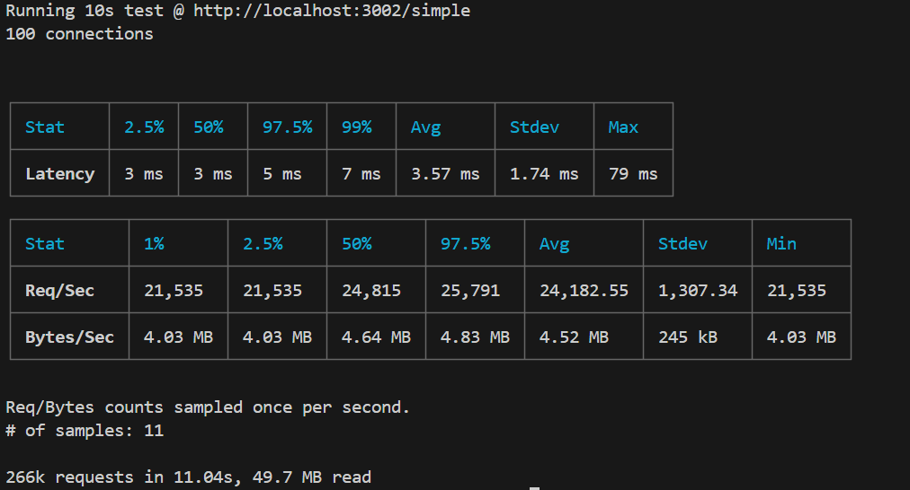 | 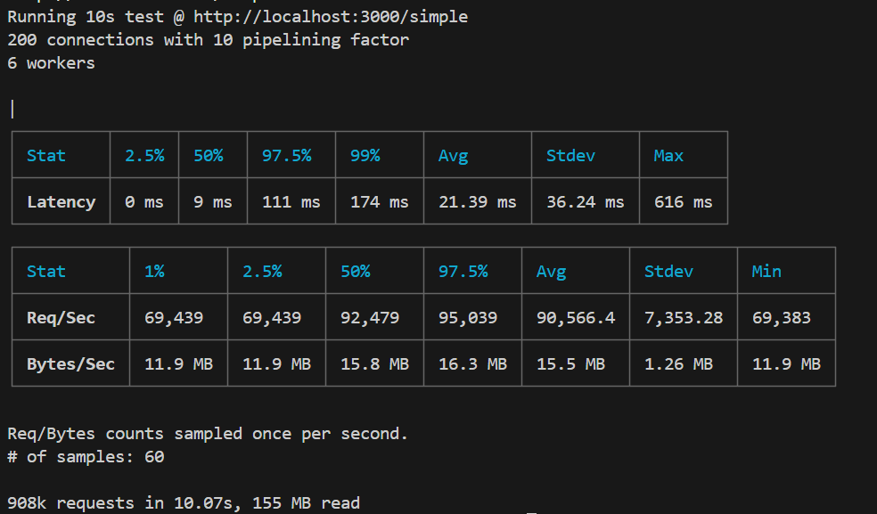 |

| Cpeak — High concurrency | Postgres — Full scan |
|:---:|:---:|
| 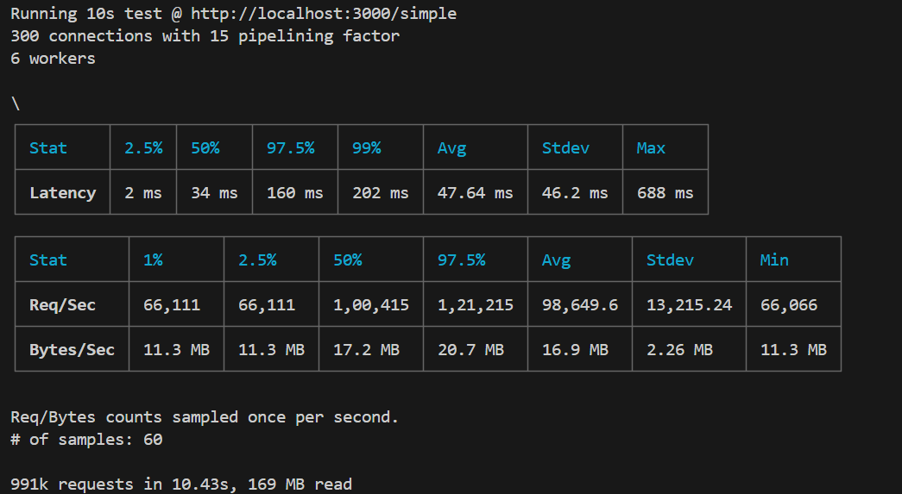 | 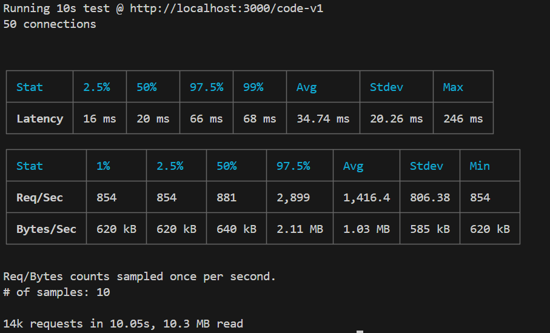 |

| Postgres — Indexed (B-Tree) | Redis — Cache lookup |
|:---:|:---:|
| 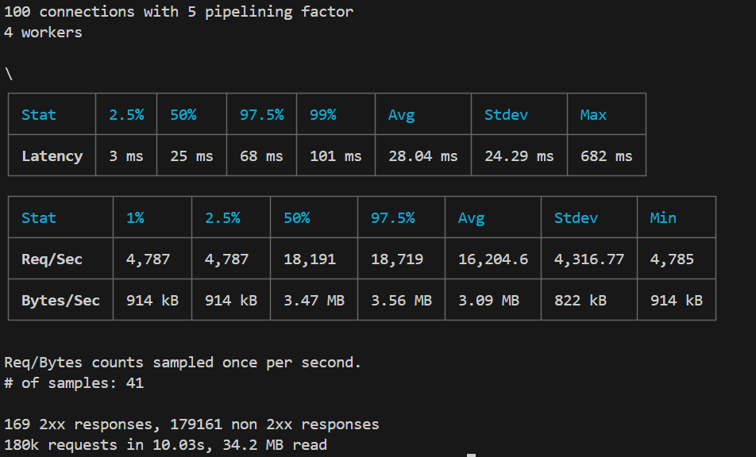 | 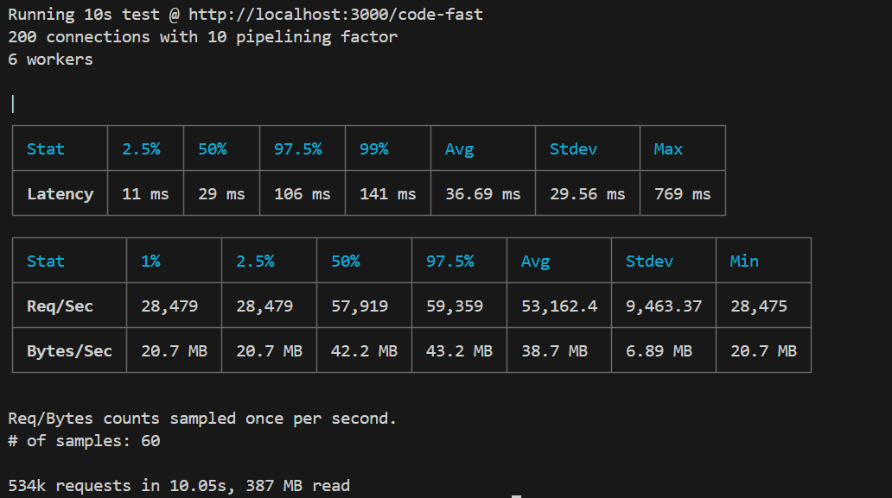 |

</details>

---

### 🔸 1,000,000 Records

This is where things get interesting. At 1M rows, the choice of storage layer becomes the **dominant factor** in throughput.

| Test | Endpoint | Connections | Pipeline | Workers | Avg RPS | p50 Latency | Total Requests |
|:-----|:---------|:-----------:|:--------:|:-------:|--------:|:-----------:|:--------------:|
| **Simple (no DB)** | `/simple` | 300 | 15 | 6 | **98,521** | 38 ms | 990k |
| Postgres — full scan 😱 | `/code-v1` | 20 | 1 | 1 | **~3** | 4,435 ms | 40 |
| Postgres — indexed (B-Tree) | `/code-v4` | 100 | 5 | 4 | **14,458** | 18 ms | 162k |
| Postgres — disk writes + txn | `/code` | 50 | 1 | 4 | **8,033** | 4 ms | 80k |
| Redis — standalone cache | `/code-fast` | 200 | 10 | 6 | **47,104** | 38 ms | 473k |
| Redis — in-memory + buffered writes | `/code-ultra-fast` | 200 | 10 | 6 | **32,710** | 46 ms | 361k |
| **Redis — 30-node cluster** 🔥 | `redis-benchmark` | — | — | — | **196,078** | 0.079 ms | 100k |

<details>
<summary>📸 <strong>View benchmark screenshots (1M records)</strong></summary>
<br>

| Simple — No DB | Postgres — Full scan (1M rows) |
|:---:|:---:|
| 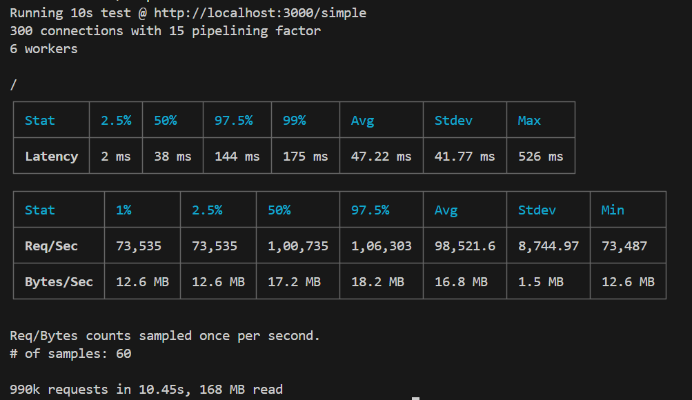 | 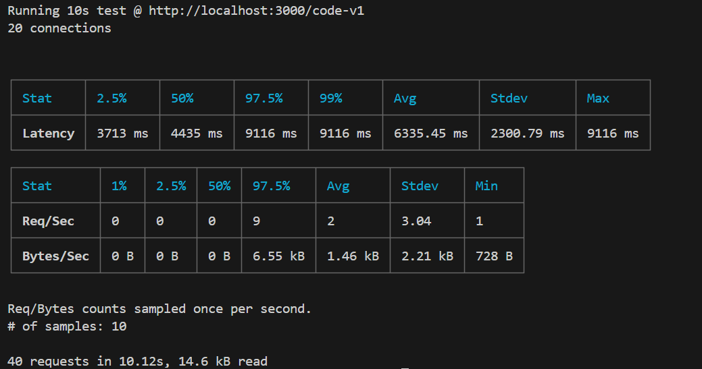 |

| Postgres — Indexed (B-Tree) | Postgres — Disk writes + transaction |
|:---:|:---:|
| 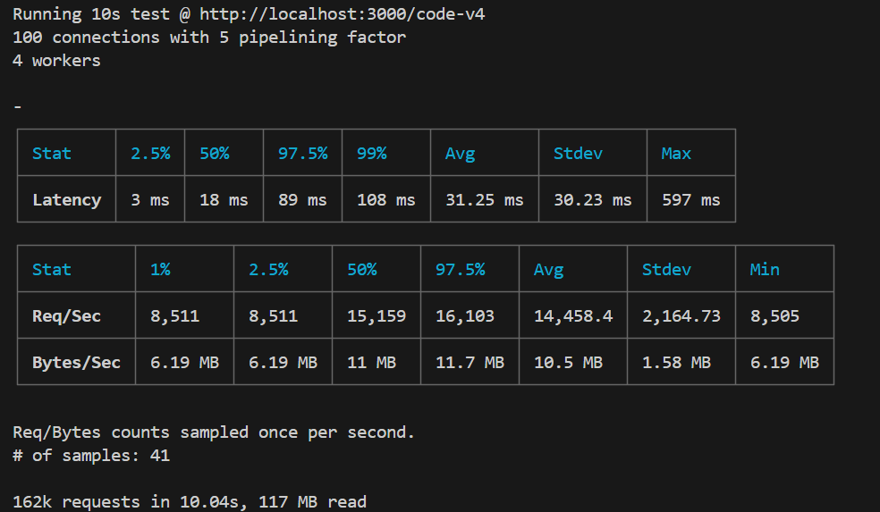 | 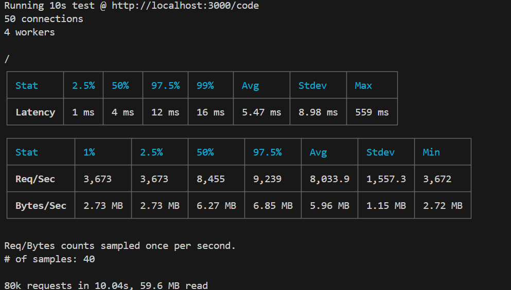 |

| Redis — Standalone cache | Redis — In-memory + buffered writes |
|:---:|:---:|
| 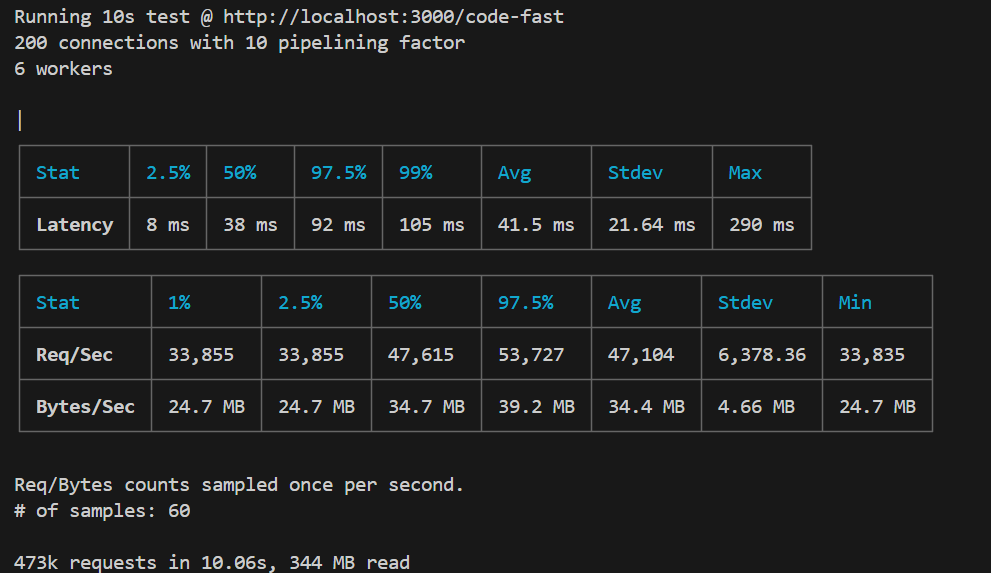 | 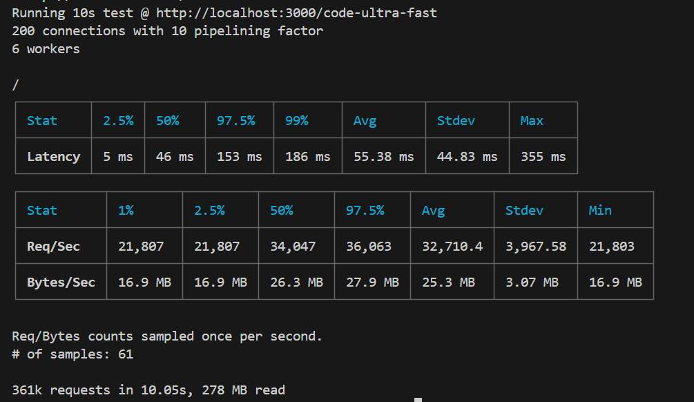 |

| Redis — 30-Node Cluster |
|:---:|
| 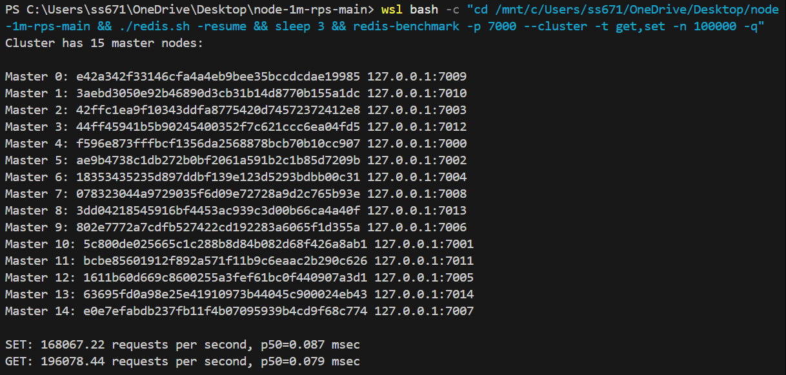 |

</details>

---

### 🧠 Key Takeaways

```
  3 RPS ──────────────────────────────────────────────────── 196,078 RPS
  ▮                                                                    ▮
  Postgres full scan (1M rows)          Redis 30-node cluster sharding
```

| # | Insight | Impact |
|:-:|:--------|:-------|
| 1 | **Indexing is non-negotiable.** A missing B-Tree index on 1M rows drops throughput from 14.5k to **3 RPS** — a 4,800× penalty. | 🔴 Critical |
| 2 | **Redis caching delivers 3.3× over indexed Postgres** with zero schema changes — just a cache-aside pattern. | 🟠 High |
| 3 | **Redis cluster sharding (30 nodes) breaks the single-core bottleneck**, scaling to 196k RPS with sub-millisecond p50 latency. | 🟢 Maximum |
| 4 | **PM2 cluster mode** saturates all CPU cores. A single Fastify thread does 24k RPS; 6 Cpeak workers hit **98k RPS** (4.1× scaling). | 🟠 High |
| 5 | **Framework overhead is minimal** at scale — the storage layer is the real bottleneck, not Express vs. Fastify vs. Cpeak. | 🟡 Medium |
| 6 | **Record count matters.** 1K-row Postgres does 1.4k RPS unindexed; at 1M rows it collapses to 3 RPS. Always benchmark at production scale. | 🔴 Critical |

---

## 🚀 Getting Started

### Prerequisites

- **Node.js** v22+ (recommended)
- **PostgreSQL** 17+
- **Redis** 7+
- **PM2** (for cluster mode): `npm install -g pm2`

### Installation

```bash
git clone https://github.com/nicolo-ribaudo/node-1m-rps.git
cd node-1m-rps
npm install
```

### Database Setup

**1. Create the config file**

Create `database/keys.js` with your Postgres credentials:

```javascript
const keys = {
  dbUser: "postgres",       // your Postgres username
  dbHost: "localhost",
  dbDatabase: "benchmark",
  dbPassword: "",           // your Postgres password
  dbPort: 5432,
};

export default keys;
```

**2. Seed the database**

```bash
# Default: 1,000 records
npm run seed

# Custom: 1 million records
npm run seed -- -r 1000000

# Go big: 20 million records
npm run seed -- -r 20000000
```

This creates the `benchmark` database (if it doesn't exist), the `codes` table, and populates it with random records.

**3. Migrate data to Redis** _(optional, for cache benchmarks)_

```bash
npm run migrate
```

> ⚠️ Migration does not work with Redis in cluster mode. Use standalone Redis.

### Running the Server

Pick any of the three frameworks — they all share the same logic and endpoints:

```bash
node cpeak.js      # Cpeak framework
node express.js    # Express framework
node fastify.js    # Fastify framework
```

You should see:

```
Cpeak server running at http://localhost:3000
[redis] standalone ready.
[postgres] connected successfully to benchmark.
```

---

## ⚙ Configuration

### Environment Variables

| Variable | Default | Description |
|:---------|:--------|:------------|
| `PG_CONNECT` | `"true"` | Connect to PostgreSQL on startup |
| `REDIS_CLUSTER` | `"false"` | Use Redis cluster mode instead of standalone |
| `F` | `"cpeak"` | Framework selection for PM2 (`cpeak`, `express`, or `fastify`) |

**Example — Redis cluster, no Postgres:**

```bash
PG_CONNECT=false REDIS_CLUSTER=true node cpeak.js
```

```
Cpeak server running at http://localhost:3000
[redis] cluster ready. Total nodes 30 (masters: 15, replicas: 15)
```

### PM2 Cluster Mode

```bash
# Start with default framework (cpeak)
pm2 start ecosystem.config.cjs

# Start with a specific framework
F=fastify pm2 start ecosystem.config.cjs
F=express pm2 start ecosystem.config.cjs

# Monitor logs
pm2 logs

# Stop everything
pm2 delete all
```

Edit `ecosystem.config.cjs` to customize instance count, environment variables, and framework selection.

### Redis Cluster (30-Node)

The included `redis.sh` script spins up a 30-node Redis cluster (15 masters + 15 replicas) on ports 7000–7029:

```bash
# Inside WSL (Linux) or native Linux
chmod +x redis.sh
./redis.sh          # First run: creates the cluster
./redis.sh -resume  # Subsequent runs: restarts existing nodes

# Verify the cluster
redis-cli -p 7000 cluster info
redis-benchmark -p 7000 --cluster -t get,set -n 100000 -q
```

---

## 🔌 API Endpoints

| Method | Endpoint | Description | Storage |
|:-------|:---------|:------------|:--------|
| `GET` | `/simple` | Returns a static JSON response (no DB) | None |
| `POST` | `/code` | Generates a new code, writes to Postgres + Redis | PG + Redis |
| `GET` | `/code-v1` | Looks up a random code via **full table scan** | PG (no index) |
| `GET` | `/code-v4` | Looks up a random code via **indexed query** | PG (B-Tree) |
| `GET` | `/code-fast` | Looks up a random code from **Redis cache** | Redis |
| `GET` | `/code-ultra-fast` | In-memory lookup + buffered disk writes | Redis + PG async |
| `PATCH` | `/update-something/:id/:name` | Simulates an update with body parsing | None |

---

## 📁 Project Structure

```
node-1m-rps/
├── cpeak.js                  # Cpeak framework server
├── express.js                # Express framework server
├── fastify.js                # Fastify framework server
├── ecosystem.config.cjs      # PM2 cluster configuration
├── redis.sh                  # 30-node Redis cluster setup script
├── utils.js                  # Shared utilities
├── autocannon.txt            # Pre-built benchmark commands
├── database/
│   ├── index.js              # PostgreSQL connection pool
│   ├── redis.js              # Redis client (standalone + cluster)
│   ├── seed.js               # Database seeding script
│   ├── migrate.js            # Postgres → Redis data migration
│   └── keys.js               # Database credentials (gitignored)
├── results/
│   ├── db_1000/              # Benchmark screenshots (1K records)
│   └── db_1m/                # Benchmark screenshots (1M records)
└── playground/               # Experimental scripts
```

---

<div align="center">

#### 💡 The bottleneck is never the framework — it's the storage layer.

_Index your queries. Cache your hot paths. Shard when you need to scale._

---

**MIT License** · Built with ❤️ and a lot of `autocannon`

</div>
